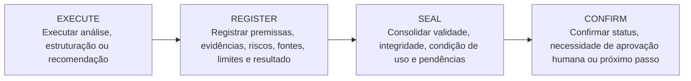

<div align="center">

# MeLL Cognitive Architecture

### Arquitetura cognitiva governada para ambientes técnicos, industriais e corporativos

<br>


<br>

**Arquitetura cognitiva governada, com autonomia supervisionada e soberania humana,  
para ambientes críticos, industriais, corporativos e regulados.**

</div>

---

## Visão geral

A **MeLL Cognitive Architecture** é a camada institucional e arquitetural por trás de iniciativas de IA governadas, projetadas para ambientes onde **confiabilidade**, **conformidade**, **rastreabilidade**, **segurança cognitiva** e **soberania humana** são requisitos essenciais.

Seu objetivo é estruturar soluções de inteligência artificial com governança desde a concepção, evitando improvisação em contextos críticos e assegurando que decisões relevantes permaneçam sob responsabilidade humana explícita.

---

## Sumário

- [Visão geral](#visão-geral)
- [Propósito institucional](#propósito-institucional)
- [Eixos fundamentais](#eixos-fundamentais)
- [Princípios arquiteturais](#princípios-arquiteturais)
- [Processo de análise e decisão governada](#processo-de-análise-e-decisão-governada)
- [Pilares de arquitetura](#pilares-de-arquitetura)
- [Produtos, assistentes e interfaces governadas](#produtos-assistentes-e-interfaces-governadas)
- [Estrutura do repositório](#estrutura-do-repositório)
- [Diretrizes de uso](#diretrizes-de-uso)
- [Governança](#governança)
- [Licença](#licença)
- [Mantenedor](#mantenedor)

---

## Propósito institucional

> A inteligência artificial não deve operar como uma caixa preta em ambientes críticos.  
> A MeLL organiza arquiteturas, produtos e interfaces de IA com supervisão humana, evidência técnica, rastreabilidade e controle de escopo.

A arquitetura foi concebida para apoiar:

- Ambientes industriais e técnicos de alta criticidade.
- Organizações com requisitos de conformidade, segurança e continuidade.
- Fluxos decisórios que exigem evidências, registros e validação.
- Produtos de IA aplicada com escopo definido e operação supervisionada.
- Separação clara entre análise automatizada e decisão humana soberana.

---

## Eixos fundamentais

| Eixo | Diretriz |
|---|---|
| **IA governada desde a concepção** | A IA deve nascer com arquitetura, escopo, supervisão, rastreabilidade e critérios de uso definidos desde o início. |
| **Ambientes críticos e regulamentados** | O foco está em contextos onde falhas podem gerar perda financeira, indisponibilidade operacional, risco à segurança, exposição de dados ou não conformidade. |
| **Decisão humana soberana** | A IA atua como camada de apoio cognitivo. Decisões críticas, autorizações, exceções e mudanças estruturais permanecem sob responsabilidade humana explícita. |
| **Inteligência operacional auditável** | Recomendações, análises, premissas e conclusões devem ser registráveis, verificáveis e tecnicamente justificáveis. |

---

## Princípios arquiteturais

A **MeLL Cognitive Architecture** adota princípios orientados à governança de IA, controle humano, segurança cognitiva, integridade documental e evolução controlada de sistemas inteligentes.

| Princípio | Aplicação prática |
|---|---|
| **Soberania humana** | Decisões críticas, aprovações e mudanças estruturais permanecem sob autoridade humana explícita. |
| **Autonomia supervisionada** | A IA pode analisar, estruturar, recomendar e apoiar, mas não substitui responsabilidade humana. |
| **Governança documental** | Documentos, evidências, versões e decisões devem possuir escopo, origem, validade e rastreabilidade. |
| **Rastreabilidade total** | Processos assistidos por IA devem manter registros verificáveis de premissas, evidências e conclusões. |
| **Integridade documental** | Conteúdos devem ser classificados, versionados e tratados conforme efeito formal e grau de validade. |
| **Segurança cognitiva** | Ambiguidade, excesso de autonomia e uso indevido de contexto devem ser tratados como riscos operacionais. |
| **Separação de responsabilidades** | Arquitetura, execução, validação, aprovação e auditoria devem manter papéis distintos e rastreáveis. |
| **Isolamento multinúcleo** | Ambientes, núcleos, módulos e produtos devem operar com escopo definido e sem contaminação estrutural. |
| **Observabilidade e auditoria** | A arquitetura deve permitir análise contínua de eventos, recomendações, riscos, decisões e evidências. |
| **Evolução controlada** | Mudanças estruturais exigem cut-off, escopo, avaliação de impacto e aprovação humana explícita. |
| **Conformidade e transparência** | A arquitetura deve apoiar aderência a políticas, normas, requisitos regulatórios e boas práticas. |

---

## Processo de análise e decisão governada

A MeLL utiliza um fluxo de integridade cognitiva para estruturar a atuação da IA em contextos técnicos, estratégicos e decisórios.



| Etapa | Finalidade | Resultado esperado |
|---|---|---|
| **EXECUTE** | Executar análise, estruturação ou recomendação dentro de escopo definido. | Produção técnica inicial. |
| **REGISTER** | Registrar premissas, evidências, riscos, fontes, limites e resultado. | Rastreabilidade e base de auditoria. |
| **SEAL** | Consolidar validade, integridade, condição de uso e pendências. | Estado formal do conteúdo ou recomendação. |
| **CONFIRM** | Confirmar status, necessidade de aprovação humana ou próximo passo. | Continuidade controlada ou decisão humana explícita. |

---

## Pilares de arquitetura

| Pilar | Descrição |
|---|---|
| **Confiabilidade** | Estruturas orientadas à continuidade, redução de falhas, revisão e controle de dependências críticas. |
| **Excelência operacional** | Processos claros, registros consistentes, melhoria contínua e operação tecnicamente controlada. |
| **Otimização de custos** | Uso proporcional de recursos, modelos, infraestrutura e automações conforme criticidade e valor. |
| **Eficiência de desempenho** | Arquiteturas projetadas para operar com coerência técnica, escalabilidade e uso eficiente de recursos. |
| **Segurança e privacidade** | Proteção de dados, controle de acesso, contenção de riscos e separação entre ambientes e responsabilidades. |
| **Conformidade** | Aderência a políticas, normas, diretrizes, requisitos regulatórios e práticas de governança responsável. |

---

## Produtos, assistentes e interfaces governadas

A **MeLL Cognitive Architecture** organiza iniciativas de IA aplicada, assistentes especializados e módulos conceituais voltados à aplicação prática de inteligência cognitiva em ambientes industriais, corporativos, energéticos, educacionais e governados.

| Produto / Interface | Categoria | Descrição |
|---|---|---|
| **CIA-Tec™** | Arquitetura | *Cognitive Intelligence Architecture — Technology*. Arquitetura federada de governança cognitiva, orientada à autonomia supervisionada, rastreabilidade, hierarquia documental, segurança cognitiva, DataCore, núcleos funcionais e soberania humana. |
| **ERSC-Core** | Industrial AI | Solução conceitual de IA industrial para governança federada de incidentes, fluxos operacionais, integrações, evidências, recomendações, classificação de riscos e execução supervisionada em ambientes técnicos. |
| **SovereignGuard CIA-Tec™** | Governança ativa | Proposta de middleware de governança ativa e cartório digital para IA, concebido como camada de segurança, evidência e controle entre sistemas inteligentes, plataformas corporativas e ambientes críticos. |
| **Chat IA — Manutenção Elétrica Industrial™** | Manutenção Industrial | Assistente técnico inteligente especializado em Manutenção Elétrica Industrial. Auxilia em diagnósticos teóricos, análise de falhas, confiabilidade, PCM, automação e energia, com segurança, linguagem clara e apoio prático para o dia a dia no chão de fábrica. |
| **Calculú — Energia Simples™** | Energia | Assistente brasileiro que simplifica a conta de luz, identifica desperdícios de energia e estima economia com explicações claras e práticas. |
| **Assistente didático de Instrumentação Industrial** | Instrumentação Industrial | Assistente técnico-didático para aprendizagem continuada em Instrumentação Industrial e Controle de Processos, com explicações claras, exemplos práticos e orientação estruturada do nível básico ao avançado. |

---

## Estrutura do repositório

```text
site-institucional/
├── README.md
├── index.html
├── assets/
│   ├── css/
│   ├── js/
│   └── img/
└── docs/
```

Este repositório representa o ambiente web institucional da **MeLL Cognitive Architecture**.

> Arquitetura modular orientada à governança, implantada via Cloudflare Pages.

---

## Diretrizes de uso

- Este conteúdo possui finalidade institucional, arquitetural e técnica.
- A IA atua como apoio cognitivo, não como autoridade decisória soberana.
- Decisões críticas, aprovações, exceções e mudanças estruturais exigem responsabilidade humana explícita.
- Recomendações e análises devem ser tratadas com rastreabilidade, revisão e validação conforme criticidade do contexto.
- Mudanças estruturais devem possuir escopo, cut-off, avaliação de impacto e aprovação humana quando aplicável.
- A ausência de comando claro, autorização explícita ou regra documentada deve ser tratada como lacuna operacional.

---

## Governança

| Item | Definição |
|---|---|
| **Modelo operacional** | Autonomia supervisionada com soberania humana. |
| **Fluxo de referência** | `EXECUTE → REGISTER → SEAL → CONFIRM` |
| **Requisitos centrais** | Confiabilidade, rastreabilidade, conformidade, segurança cognitiva e integridade documental. |
| **Decisão crítica** | Requer responsabilidade humana explícita. |
| **Mudança estrutural** | Requer escopo, cut-off, análise de impacto e aprovação quando aplicável. |

---

## Licença

Licença, uso comercial e termos de distribuição: **a definir pelo mantenedor do repositório**.

---

## Mantenedor

**MeLL Cognitive Architecture**  
Arquitetura cognitiva governada para ambientes técnicos, industriais e corporativos.

---

<div align="center">

**MeLL Cognitive Architecture**  
Governança cognitiva • Rastreabilidade • Segurança • Soberania humana

</div>
